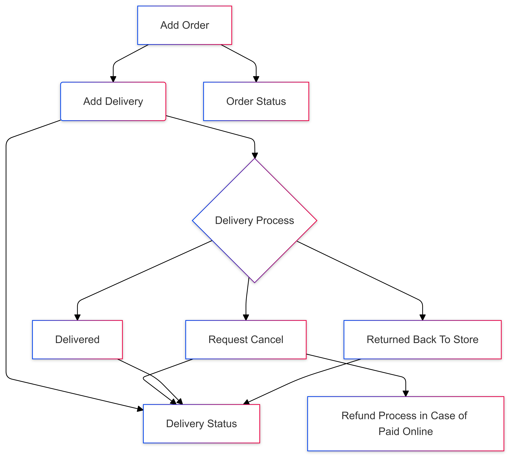

``` flow
flowchart TD
    B("Add Delivery") --> C{"Delivery Process"} & n8["Delivery Status"]
    C --> n1["Returned Back To Store"] & n4["Delivered"] & n5["Request Cancel"]
    n5 --> n6["Refund Process in Case of Paid Online"] & n8
    A["Add Order"] --> B
    n4 --> n8
    n1 --> n8
    A --> n7["Order Status"]
```
